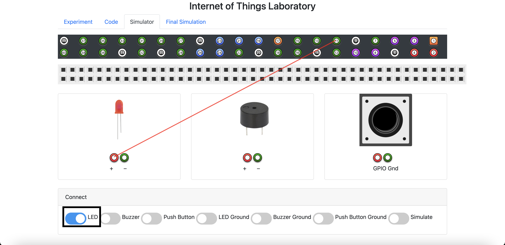

### These procedure steps will be followed on the real time circuit connections:

1.Open Terminal  

    

2.Launch IDLE IDE   

    

3.After the IDLE launches, open a new window by FILE>OPEN or Ctrl+N  

    

4.Type the code.  
5.Save the code by FILE>SAVE or Ctrl+S  

    

6.To run your code RUN -> RUN or Ctrl+F5  

    

### These procedure steps will be followed on the simulator:

1. This simulator allows users to simulate interfacing of LED,Buzzer,Switch with Raspberry Pi board. 
2. In the Experiment tab, you can get to know the aim of this experiment,how to work with this simulator and a code reference enabling you to program the raspberry pi board. 

3. Using the given code below, program the raspberry pi board. 

4. Once you finished programming the board,click on the check code button.If you get a success message you can proceed for the simulation, Else please take a look at the code and reprogram the board. 

5. In the simulation part, you can connect the LED,buzzer,push button,ground connections with a click of button. 
6. Click on the Connect LED,Connect Buzzer,Connect Button,Connect Gnd Connections buttons to connect the components with GPIO pins. 

7. Once you connect all the components, click the simulate button which will check the correctness of the circuit and gives you the result as alert. 

8. Once the simulation is successful click on the final simulation tab. 

9. Click the Push button and you can note that LED and buzzer is in ON state for the time interval you mentioned during the programming step. 

