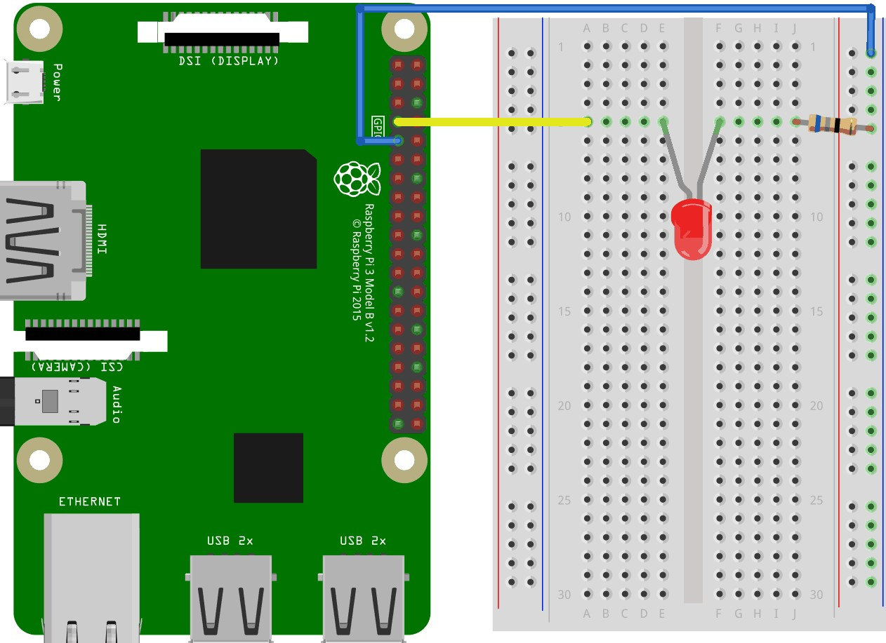
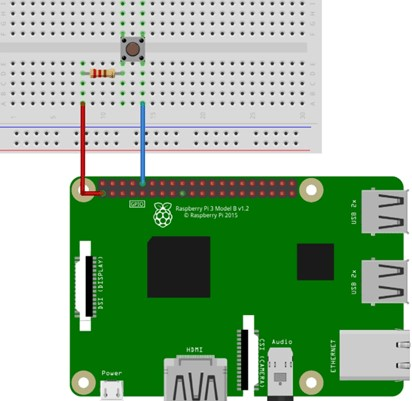
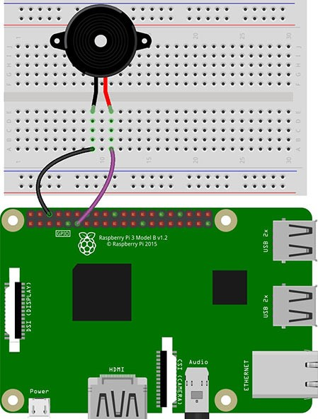

#### <u>INTRODUCTION</u>

&nbsp;&nbsp;&nbsp;&nbsp;&nbsp;&nbsp;&nbsp;&nbsp;&nbsp;&nbsp;&nbsp;&nbsp;&nbsp;&nbsp;&nbsp;&nbsp;Internet Of Things(IOT) is a term that refers to a system of interrelated things such as digital machines,electrical and electronic devices etc  which have sensors, software, and other technologies and has the ability to transfer data over a network without requiring human-to-human or human-to-computer interaction.IOT works on the principle **"Anything that can be connected, will be connected"**. 

##### <u> RASPBERRY PI </u>
The Raspberry Pi is a small, affordable, and amazingly capable, credit card size computer.
It is developed by the Raspberry Pi Foundation, and it might be the most versatile tech ever created.Creator Eben Upton's goal was to create a low-cost device that would improve programming skills and hardware understanding.Due to the small size and price of the device, it has become the center of a wide range of projects by tinkerers, makers, and electronics enthusiasts.The Raspberry Pi has a row of GPIO (General Purpose input/output) pins, and these can be used to interact in amazing ways with the real world.
 

##### <u> LED </u>
&nbsp;&nbsp;&nbsp;&nbsp;&nbsp;&nbsp;&nbsp;&nbsp;&nbsp;&nbsp;&nbsp;&nbsp;&nbsp;&nbsp;&nbsp;&nbsp;LED stands for Light Emitting Diode, and glows when electricity is passed through it.The LED will have two terminals, you can notice one leg is longer than the other. The longer leg (known as the ‘anode’), is always connected to the positive supply of the circuit. The shorter leg (known as the ‘cathode’) is connected to the negative side of the power supply, known as ‘ground’.LEDs will only work if power is supplied the correct way round (i.e. if the ‘polarity’ is correct). You will not break the LEDs if you connect them the wrong way round – they will just not light. If the LED does not light in your circuit, it may be because of that, it have been connected the wrong way round.A simple LED circuit consists of a LED and resistor. The resistor is used to limit the current that is being drawn and is called a current limiting resistor. Without the resistor the LED would run at too high of a voltage, resulting in too much current being drawn which in turn would instantly burn the LED, and likely also the GPIO port on the Raspberry Pi. 

    
    
Basic LED interfacing 
(Source : <a href="https://www.w3schools.com/nodejs/nodejs_raspberrypi_blinking_led.asp">https://www.w3schools.com/nodejs/nodejs_raspberrypi_blinking_led.asp</a>)

##### <u> Push button </u>
&nbsp;&nbsp;&nbsp;&nbsp;&nbsp;&nbsp;&nbsp;&nbsp;&nbsp;&nbsp;&nbsp;&nbsp;&nbsp;&nbsp;&nbsp;&nbsp;The standard form of switch used in electronics is a push button switch. This push-button Single Pole,Single Throw(SPST) switches are used to either make or break a circuit by a simple push action. They generally come in the normally open (NO) configuration.Toggle Switches make or break a circuit by moving a lever up or down and comes in Single Pole,Single Throw(SPST), Single Pole,Double Throw(SPDT), and Double Pole,Double Throw(DPDT) configurations. Some toggle switches have an off position in the center, and the circuit can be turned on by moving the lever in either the up or down direction. 

    
 
Push Button interfacing 
(Source : <a href="https://raspberrypihq.com/use-a-push-button-with-raspberry-pi-gpio/">https://raspberrypihq.com/use-a-push-button-with-raspberry-pi-gpio/</a>)

##### <u>Buzzer </u>
&nbsp;&nbsp;&nbsp;&nbsp;&nbsp;&nbsp;&nbsp;&nbsp;&nbsp;&nbsp;&nbsp;&nbsp;&nbsp;&nbsp;&nbsp;&nbsp;A Piezo buzzer is a device that is used to generate beep sound (generally a warning or alert in embedded system). It is a two leg device the longer leg is positive. If voltage is supplied to it, it generates beep sound.  They work by using a piezo crystal, a special material that changes shape when voltage is applied to it.  If the crystal pushes against a diaphragm, like a tiny speaker cone, it can generate a pressure wave which the human ear picks up as sound.Through analog write PWM(Pulse Width Modulation) signal volume of beep sound can be controlled. If a buzzer is switched with different time intervals it generates a melody. 

    
 
Piezo Buzzer interfacing 
(Source : <a href="https://electropeak.com/learn/tutorial-raspberry-pi-gpio-programming-using-python-full-guide/">https://electropeak.com/learn/tutorial-raspberry-pi-gpio-programming-using-python-full-guide/</a>)

